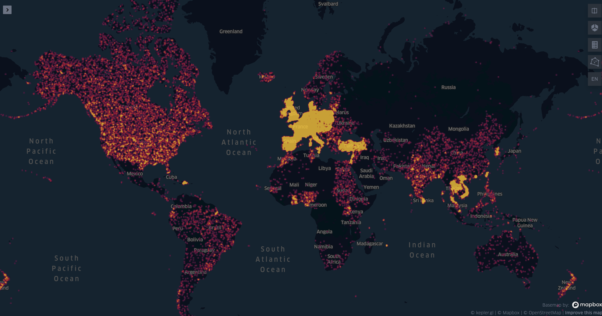
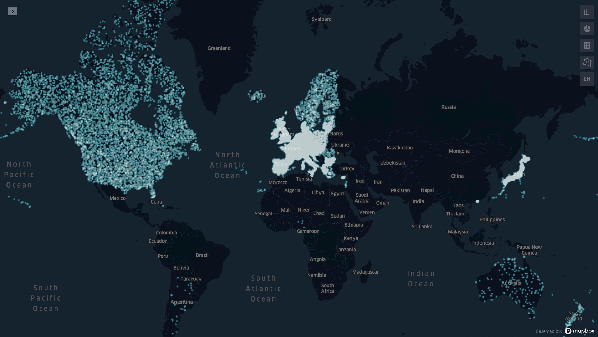
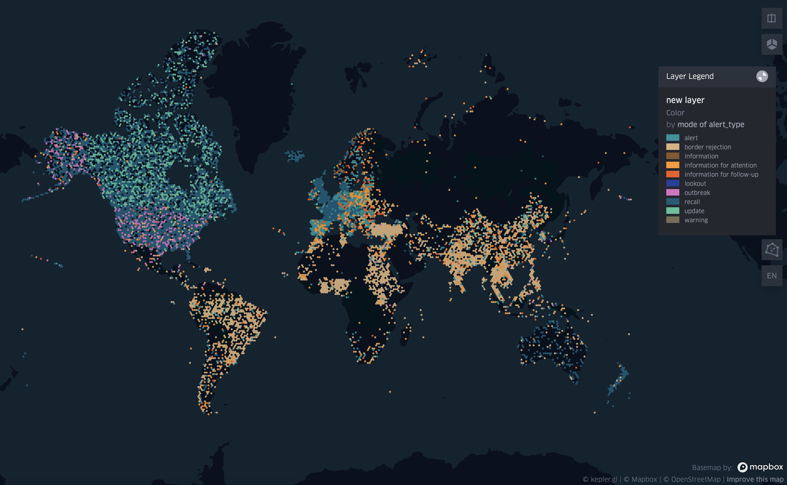
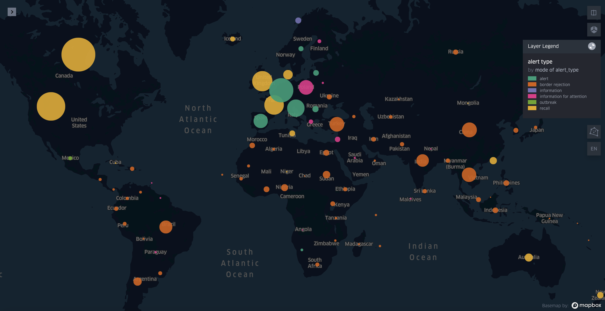
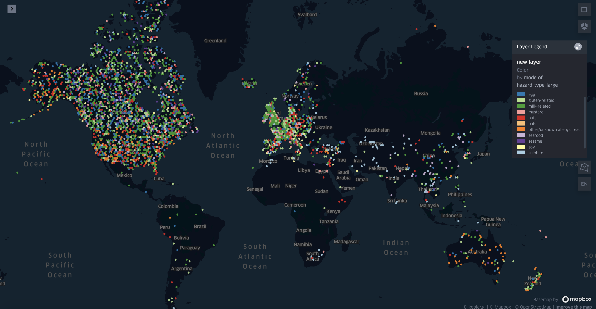
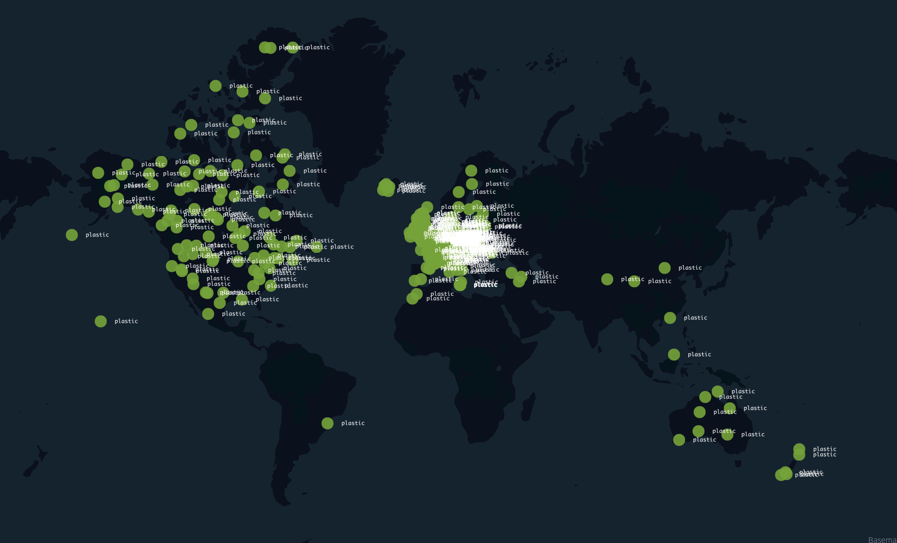

# JGI-food-hazards-viz-challenge

This repo contains the work done for Jean Golding Institute Food hazards [data visualisation challenge][1]

The entry for the challenge is available here: https://mvab.github.io/JGI-food-hazards-viz-challenge/

 

Below are some outtakes from out KeplerGL visualisation attempts, which are too pretty to not show anyone: 

_Food hazard alert origins_
  
 
_Countries that notify about hazards_
   

_Types of alerts that come different locations_
   
 
_Types of alerts that come different locations, grouped by region_
 
 
 _Types of allergens that come different locations_
   
 
_Plastic pollution in food_
   

[1]: http://www.bristol.ac.uk/golding/get-involved/competitions/food-hazards-from-around-the-world-data-competition/
