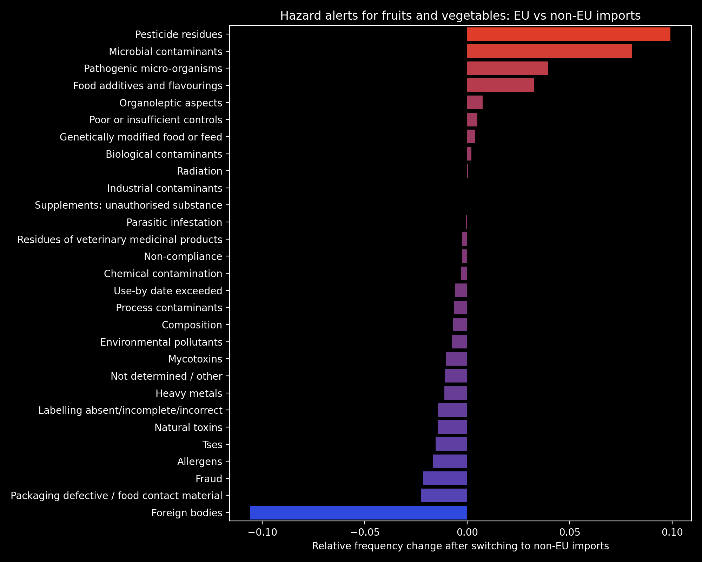
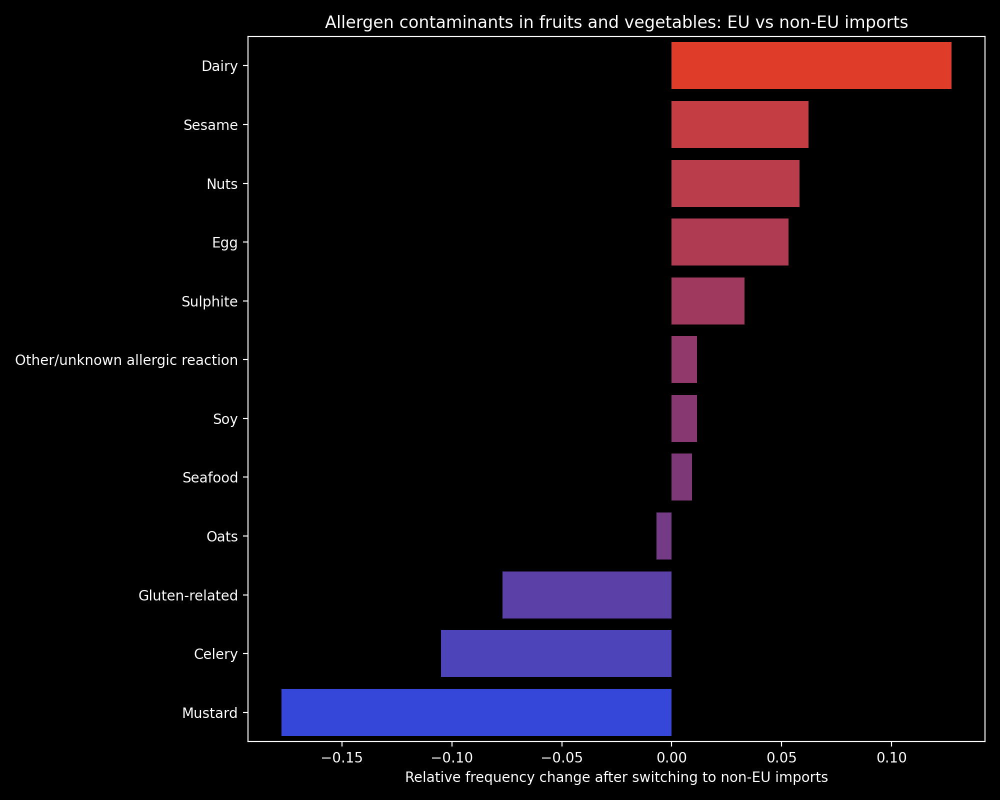
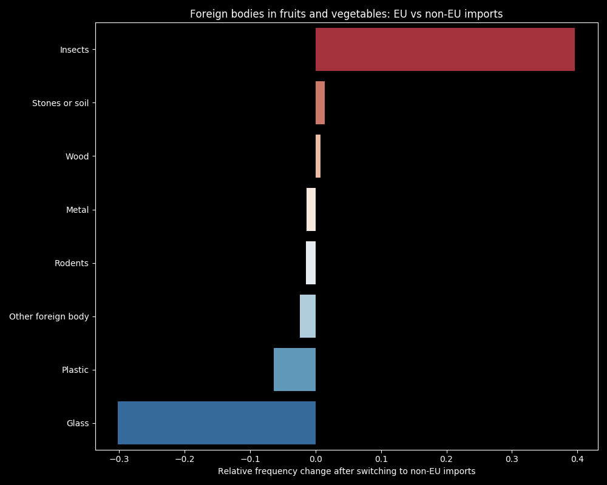

The United Kingdom is scheduled to leave the European Union at the end of 2020 following results of a referendum in 2016. Final exit deal details are still being negotiated in the currently ongoing transitional period, but it is inevitable that food trade and safety will be affected.

The current food safety system in the UK relies on regulations administered at the EU level. The EU has one of the highest food safety standards in the world – largely thanks to the solid set of EU legislation in place, which ensures that food is safe for consumers. The main reporting system is RASFF (Rapid Alert System for Food and Feed) [[1]][1], which provides a round-the-clock service of sending, receiving and responding to food hazard alerts collectively and efficiently. The system is accessible to EU members and EEA countries, and the reporting is done on both EU internally traded goods and anything entering the EEA borders.

The United Kingdom will lose access to RASFF data after Brexit in case of no-deal, as informed by Public Health Minister Steve Brine, MP in 2018 [[2]][2], [[3]][3].  

In dataset provided for this challenge, around 40% of alerts come from RASFF. For the UK, RASFF provides the majority of alerts on imported food from Europe and the rest of the World. The UK’s internal systems, which include FSA (Food Standards Agency) and Trading Standards, provide the alerts mostly on food originated within the UK.

### Food hazard alerts in the UK

We visualised where the food hazards identified in the UK come from. The lines show the countries of origin for food imports to the UK, and the map density[^1] shows where the most food hazard alerts originate from. 

We show two views: 1) EU alert system notifications (RASFF) and 2) UK internal notifications (FSA and Trading Standards). If the UK loses access to RASFF and also has to negotiate trade deals with non-EU countries, the loss of food hazards information regarding our own imports will be tremendous, and the FSA would have to develop and extend their alert system (which currently appears to only focus on national-level hazards) to ensure food safety from internationally imported goods. 

  

**EU alerts:** | [interactive version of the map](content/kepler_notifications_about_UK_all.html) | [static version of the map](content/notifications_about_UK_all.png)

**UK-internal alerts:** | [interactive version of the map](content/kepler_notifications_about_UK_by_UK.html) | [static version of the map](content/notifications_about_UK_by_UK.png)

### Closer look at Fruit and Veg

Systems will need to be put in place to make up for the loss of information from RASFF alerts. An increase on tariffs for EU-produced food after Brexit [[4]][4] will likely cause an uptick in importers buying from outside of the union, which would bring an accompanying shift to the makeup of food hazards that such systems will need to detect. The following graphics briefly explore how this shift might materialize for the UK’s biggest food import [[5]][5]: fruits and vegetables.

The plots below show the difference[^2] between the occurrence rates of various food hazards in EU vs non-EU fruits and vegetables.

  

Comparison of the hazard alert types reported on fruits and vegetables between EU and non-EU countries shows that non-EU produce has considerably higher levels of pesticides, microbial and pathogenic contaminants, and food additives and flavourings.  Interestingly, the inverse is observed for foreign bodies, packaging contamination, and allergens. 

While reports of certain contaminants may indeed go down upon switching to non-EU food sources, this does not necessarily mean that the actual frequency of cases for these types of contaminations will go down as well. It is certainly plausible that the larger number of reports for EU-sourced food is an artefact of the more stringent guidelines that the EU has in place for sending out these alerts. As a result, it is prudent to examine these specific contaminant classes further so that we can be best prepared for the murkier threat that they might pose.

  

Fruits and vegetables from non-EU countries show higher levels of contamination with the most common food allergens (dairy, eggs, nuts). Due to the UK’s relatively high prevalence of food allergies [[6]][6], it is vital that UK internal systems can detect and report quickly upon any allergen contaminants in imported food, and be ready for shifts in relative threat levels that might be induced by importing from non-EU sources.

  

Insect contamination sees a large increase in relative frequency for fruit and vegetables imported from outside of the EU. There are many health-related issues associated with this type of contamination [[7]][7], such as the carrying of harmful micro-organisms, but there are also ecological concerns at play here. Invasive species can have quite devastating economic impacts [[8]][8], and given the already large level of economic uncertainty faced by the UK due to Brexit and Covid-19, we might do well to step up our diligence against such threats to our own agricultural systems.

In conclusion, the potential effects of Brexit on the UK’s food safety standards are numerous and complex, and in this brief analysis, we have barely scratched the surface of the issue. Striking a deal to have continued access to RASFF data seems like it would be a positive action for the UK, but that would surely incur political ramifications that are beyond the scope of what is being considered here. Regardless, the FSA certainly has a very central role to play in keeping an independent Britain healthy, both in this transitional period and beyond.

[^1]:  Density maps were generated by sampling random coordinates from polygons of country shapes. As polygons are just shapes and population density is not considered, some coordinates are located in uninhabited areas (e.g. north of Canada), and therefore locations should not be interpreted literally.

[^2]: These plots were generated in a kind of all-or-nothing scenario which is unlikely to ever occur in real life. As a result, the absolute values plotted here should not be taken as gospel, but rather as a rough guide to the general changes in imported food hazards that we may observe in the coming years.

---
_This work was undertaken as part of a [data challenge][10] organised by the Jean Golding Institute for Data-Intensive Research at the University of Bristol and the Food Standard Agency (FSA)_

---

[1]: https://ec.europa.eu/food/safety/rasff_en
[2]: https://www.foodsafetynews.com/2019/03/food-safety-issues-up-in-the-air-as-u-k-approaches-brexit-u-s-food-targeted/
[3]: https://www.parliament.uk/documents/lords-committees/eu-energy-environment-subcommittee/Correspondence/SBtoLT-RASFF-190319.pdf
[4]: https://publications.parliament.uk/pa/ld201719/ldselect/ldeucom/129/12905.htm
[5]: https://www.gov.uk/government/publications/food-statistics-pocketbook/food-statistics-in-your-pocket-global-and-uk-supply#uk-trade-in-different-food-groups-2019
[6]: https://www.allergyuk.org/assets/000/001/369/Stats_for_Website_original.pdf?1505209830
[7]: https://www.food.gov.uk/sites/default/files/media/document/Chapter6-Pest_control_0.pdf
[8]: https://www.pnas.org/content/113/27/7575
[10]: http://www.bristol.ac.uk/golding/get-involved/competitions/food-hazards-from-around-the-world-data-competition/
 

