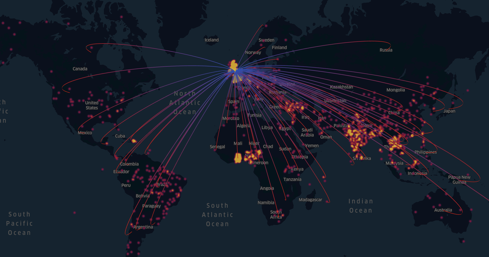
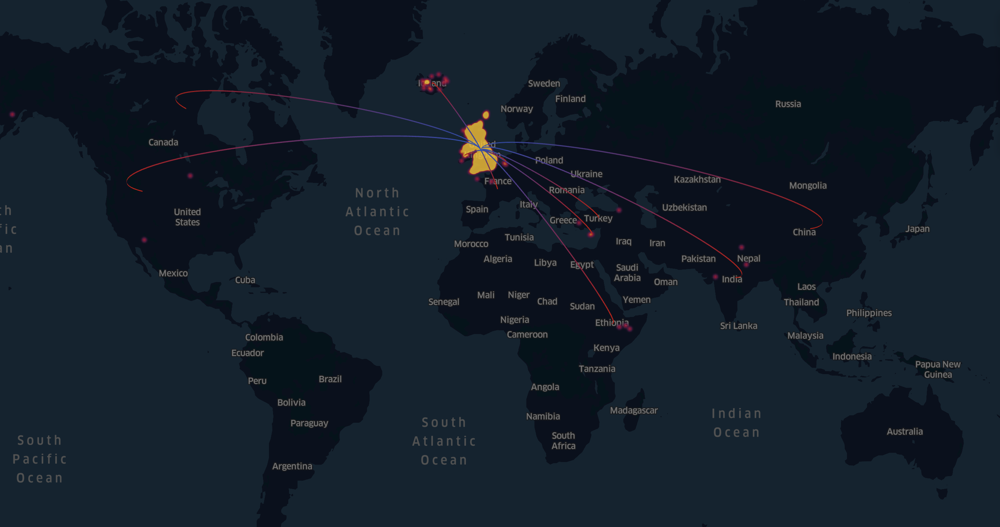

**Hello**

Text about RAFSS/Brext/trade deals/new food sources for UK
Lorem ipsum dolor sit amet, consectetur adipiscing elit, sed do eiusmod tempor incididunt ut labore et dolore magna aliqua. Ut enim ad minim veniam, quis nostrud exercitation ullamco laboris nisi ut aliquip ex ea commodo consequat. Duis aute irure dolor in reprehenderit in voluptate velit esse cillum dolore eu fugiat nulla pariatur. Excepteur sint occaecat cupidatat non proident, sunt in culpa qui officia deserunt mollit anim id est laborum

### Notifications by RAFSS about UK food imports
  

[View interactive version of the map](http://mvab.github.io/JGI-food-hazards-viz-challenge/content/kepler_notifications_about_UK_all_v2.html)

### Notifications by UK-internal alert systems about food imports
  

[View interactive version of the map](http://mvab.github.io/JGI-food-hazards-viz-challenge/content/kepler_notifications_about_UK_by_UK_v2.html)

### Closer look

Text about  Fruit and Veg being the largest imported category from the EU + want to check what type of hazards non-EU F&V eimports may hold
+ description

  

Text about looking at allergens

  

Text about looking at foreign bodies

  

---
_This work was undertaken as part of a data challenge organised by the Jean Golding Institute for Data-Intensive Research at the University of Bristol and the Food Standard Agency (FSA)_
